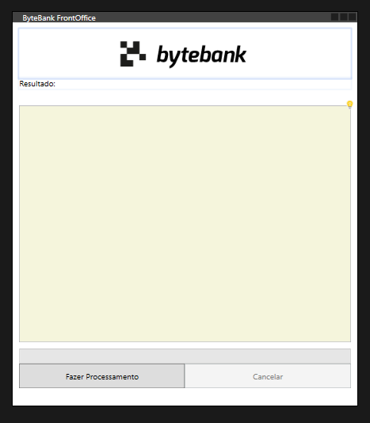

# Paralelismo com CSharp e .NET

🚧 Projeto em construção.

## ByteBank: Nosso Sistema Bancário

Neste curso, utilizaremos o ByteBank, um sistema bancário simulado, como contexto para aplicar os conceitos de programação paralela. O ByteBank é um exemplo fictício de um banco, e ao longo do curso, você terá a oportunidade de aprimorar suas habilidades enquanto trabalha com um sistema de software realista.

        

## O que Estamos Aprendendo

### Executar Tarefas em Paralelo com Async Await
Descubra a importância de utilizar o Async Await do C# para executar tarefas de forma assíncrona, permitindo a criação de aplicações mais eficientes e responsivas, crucial para atender às demandas contemporâneas de performance e experiência do usuário.

### Utilizar Todos os Cores do seu Processador
Aprofunde-se em técnicas práticas que mostram como aproveitar ao máximo os recursos do seu processador, distribuindo tarefas em paralelo para otimizar o desempenho da aplicação. Essa habilidade é essencial para desenvolvedores que buscam criar software altamente eficiente.

### Criar Aplicações Responsivas e Performáticas
Explore técnicas avançadas para criar aplicações responsivas, garantindo uma experiência de usuário suave mesmo em situações de operações demoradas. Isso é fundamental para o sucesso de qualquer aplicativo moderno.

### Escrever um Código Limpo com Recursos Modernos do C#
Pratique a escrita de código limpo e utilize os recursos modernos do C# para desenvolver aplicações mais legíveis, sustentáveis e eficientes. Adquira habilidades que não apenas melhoram a qualidade do código, mas também tornam o desenvolvimento mais eficiente e colaborativo.

### Criar Tarefas Canceláveis e Mostre o Progresso ao Usuário
Aprenda a criar tarefas canceláveis e implementar padrões de notificação de progresso para manter os usuários informados sobre o andamento das operações. Isso é crucial para oferecer uma experiência transparente e controlável aos usuários finais.

## Importância do Aprendizado

O conhecimento adquirido não apenas fortalecerá suas habilidades como desenvolvedor, mas também o capacitará a criar aplicações mais eficientes, responsivas e alinhadas com as melhores práticas modernas. O domínio desses conceitos é fundamental para se destacar no cenário de desenvolvimento de software atual.

## Tecnologias Utilizadas
- **Linguagem de Programação:** C#
- **Ambiente de Desenvolvimento Recomendado:** Visual Studio.

Certifique-se de ter essas ferramentas instaladas em sua máquina antes de iniciar o projeto.

## Como Iniciar

Para começar, siga estas etapas simples:

1. Clone este repositório em sua máquina local usando o comando:
git clone [https://github.com/seu-usuario/curso-csharp-paralelismo.git](https://github.com/Elizeu-Santos/ByteBank.git)

2. Abra o projeto no seu ambiente de desenvolvimento preferido (recomendamos o Visual Studio).
